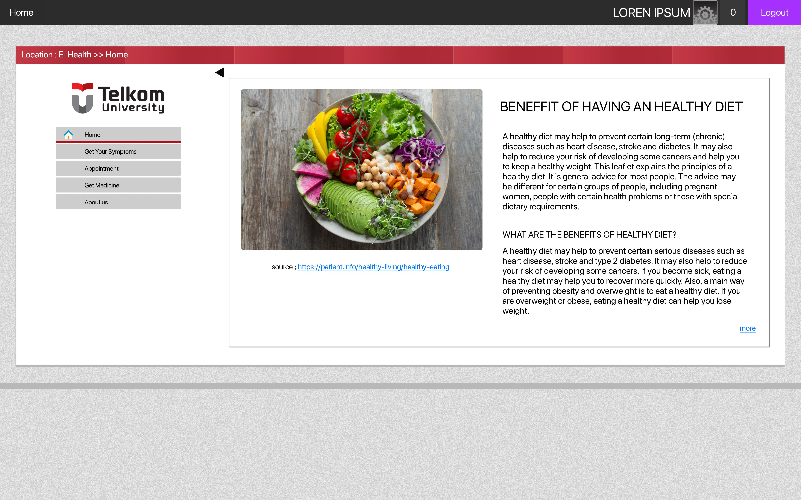
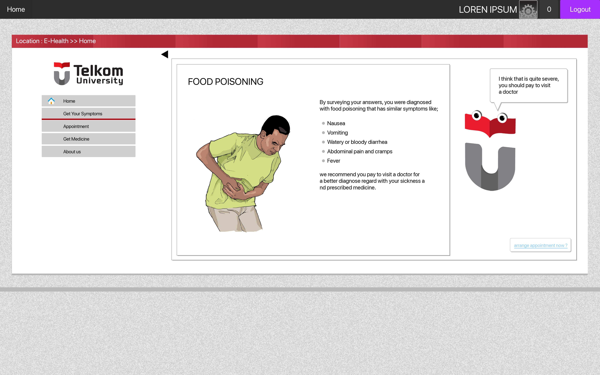
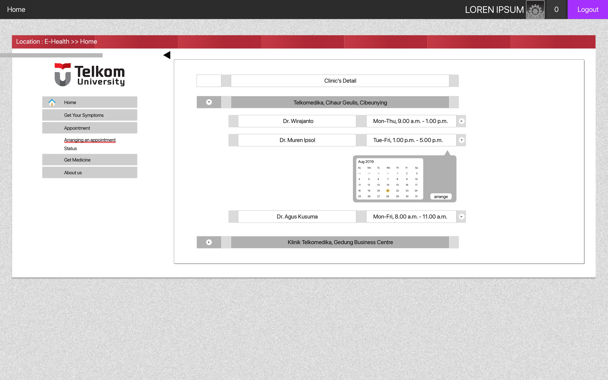

# E-Health Webpage Prototype

People always become ignorant when it comes to health the problem where eventually they tend to care about their condition when it worsens or muddles their daily routines. The main reason for the ignorant is laziness, financial issues, false diagnosis, and the rest.
The reasons above that inspired us to create a services for managing this health care problem by using a very simple and an effective way that every people, especially people in 
the university organization.

Trying to embed an E-health function through the university web portal where almost everyone uses would be the best option.
Although the target was almost every person, our key focus was the university students to be the first user of this new function because of their lack of awareness about their health. Hopefully, this feature can help increased student's cognizance of their health. Through this design would make students acquire health services and prescribed medicine more affordable and easy to access. It will record all the data whenever a student uses the university health care for further diagnosis. There were five features in the design; Health article, Get your symptom, Appointment, Get medicine, and about the healthcare instances.
 

<h3>Health Article</h3>

Through their name itself can inform you about the primary function. First, the health article feature; indeed its name describes itself. It stores a couple of health articles on the home page. Wet try to substitute for every three days to keep it all fresh and diverse also easy to be applied to student life.

<h3> Get Your Symptom </h3>

Next, get your symptom feature where we embedded machine learning to tell your early diagnosis by some questions which branch for a more accurate diagnosis. We teach the algorithm with all the data regarding symptoms and diseases. Thus, machine learning will give you four simple questions which specify your early diagnosis where the data is store in a server for further diagnosis. The algorithm will also hand an option to make an appointment with a clinic that cooperates under the university name.

<h3> Appointment </h3>

Next, the appointment feature is where you arrange a schedule for consulting with a doctor in the clinic. You can see all the available doctors throughout this feature. This feature showed the status appointment that is requested with the selected doctor. If the doctor approves the patient's appointment request, the patient can attend the session within the doctor's schedule.

<h3> Get Your Medicine </h3>

Next, get your medicine feature where after you finish with the consultation; then the doctor input the prescribed medicine recipe to the pharmacist throughout the server. The patient will be able to take their medicine at the clinic where they attend their consultation. They just needed to state their student id number to collect their prescription.

<h3> About Us </h3>

Last, the about the health instances feature will show you the basic information about the clinic. Where the exact address and location of the clinic, also the clinic phone number.
 

## About the Project

This E-health webpage prototype creates as my past university project. I did not have enough knowledge, time, and human power to finish the project. I am trying to continue what I have left before and tracking the progress on this website.

## Screenshots

<figure>
  
  
  
</figure>
